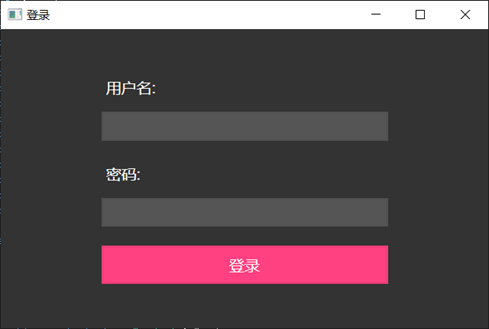
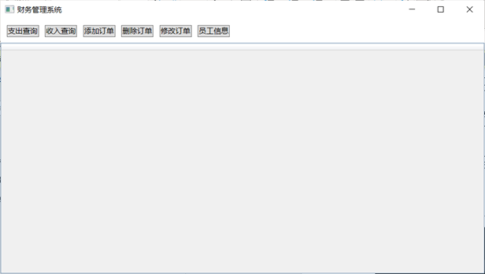
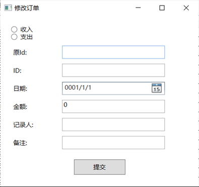
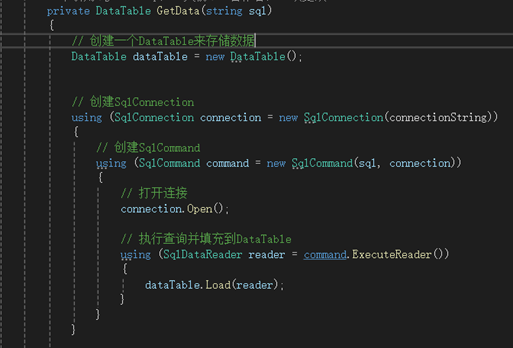
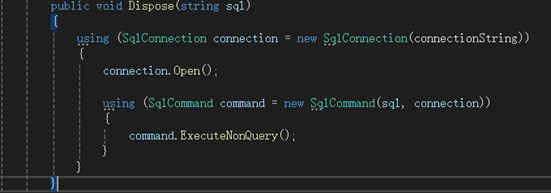
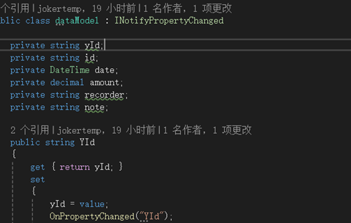

数据库

收入表   [收入ID],[日期],[金额],[记录人],[备注]
支出表   [支出ID],[日期],[金额],[记录人],[备注]
员工信息表 [员工ID],[姓名],[联系方式]

视图 QueryExpenditure  查询收入，记录人的id换成名字。
     QueryIncome  查询支出，记录人的id换成名字。

存储过程：InsertInto收入表  用于快速填充数据
InsertInto支出表 快速填充数据

页面 

登录页面

主页面

修改订单页面

业务代码

查询函数

添加，删除，修改共用的函数

数据模型

